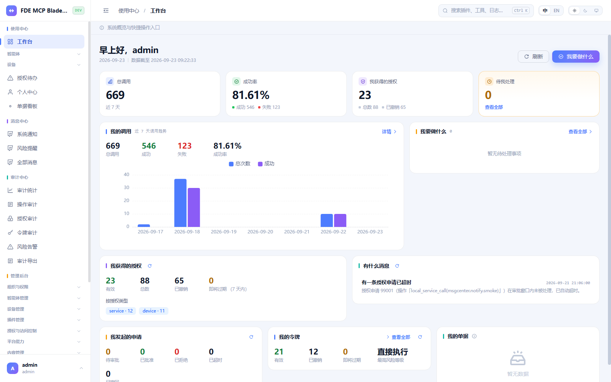
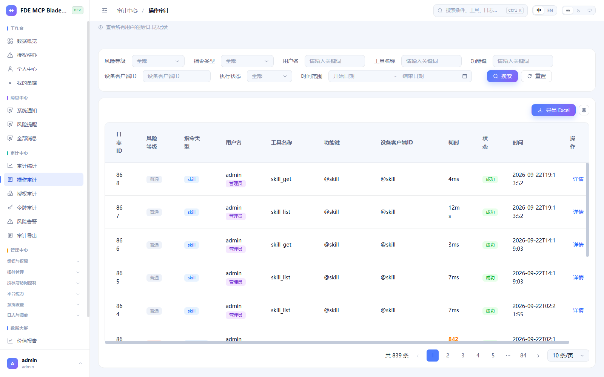
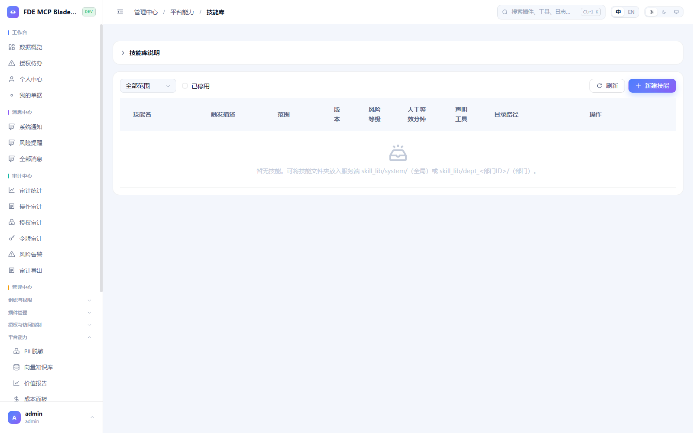
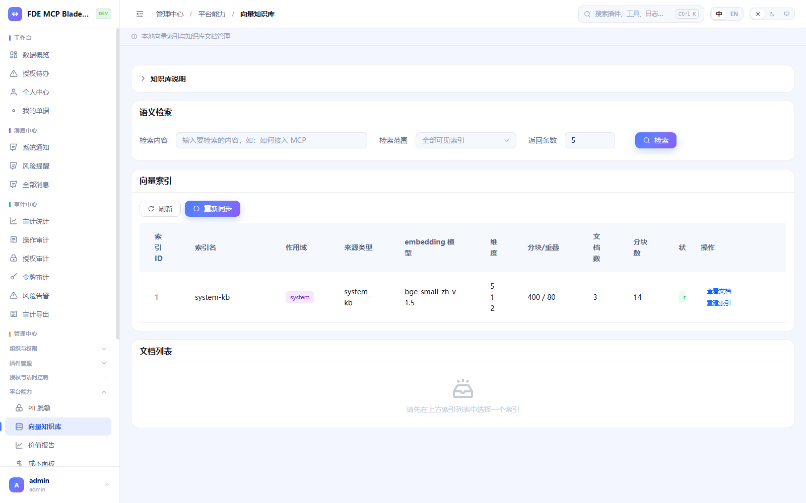
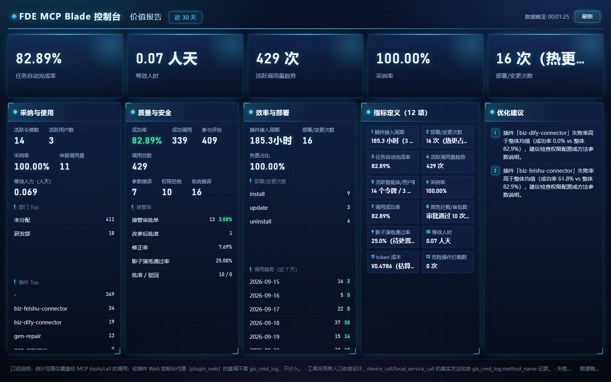
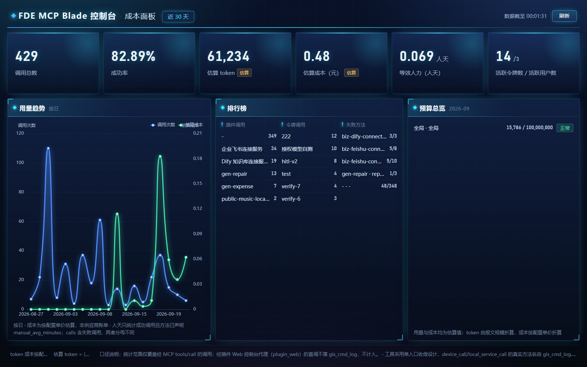
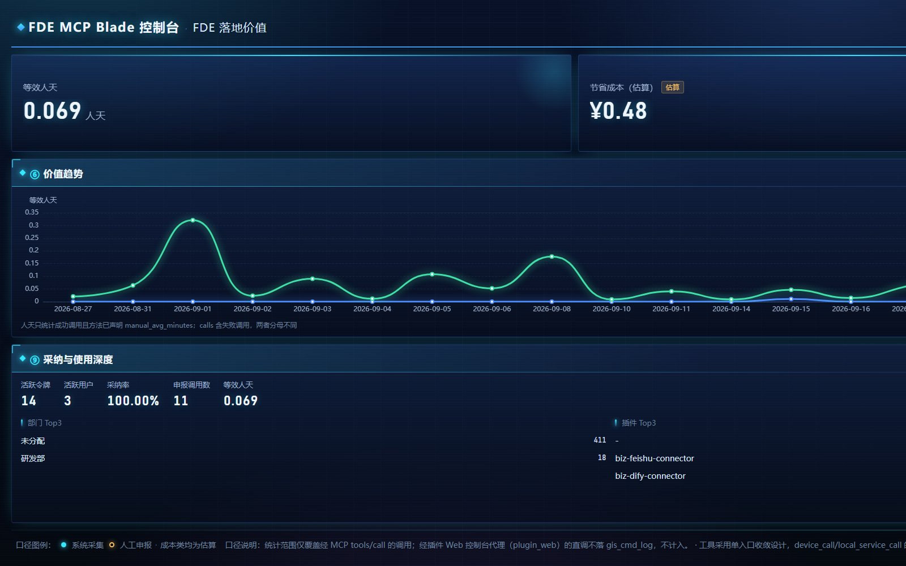

<div align="center">

# FDE MCP Blade

**部署在你客户机房里的 AI 工具箱 —— 面向 FDE 与集成商的企业内网 AI 工具接入与治理中台**

[](./LICENSE)
[](./fde-mcp-blade)
[](https://modelcontextprotocol.io)
[](./fde-mcp-blade-admin)
[](https://fde.agent-plat.com)
[](#反馈与内测邀请)

[English](./README.md) | **中文**

</div>

---

> **一句话定位**：把企业内系统收敛为**统一的 MCP 工具入口**，让任何平台的 AI Agent 在既定权限与审计约束下调用企业能力——数据不出内网，操作全留痕，不锁定任何智能体平台。

> 🌍 **在线体验**：<https://fde.agent-plat.com>（演示账号 `admin / admin123`，数据为演示数据，请勿存敏感信息）

市面上的平台负责"让 AI 聪明"，Blade 负责"让 AI 能进企业、进得安全、用得放心"。它不做推理编排、不托管大模型，卡位在技术爆炸之下最可沉淀的那一层：**工具提供层**。

| | |
|---|---|
| 🚀 **装得快** | 一条命令部署，Docker + MariaDB 双服务即完整；首次启动自动建库建表；最低 1 核 / 1GB / 16GB（树莓派实测可跑） |
| 🔒 **管得住** | 五重安全（鉴权·权限·时效·防绕过·频控）+ 风险四级 + 高危人工审批；凭证分离，密钥永不下发 Agent |
| 📋 **查得清** | 操作 / 授权 / 令牌 / 登录 4 类审计全链路留痕，可回放、可导出；导出动作自身也留痕 |
| 🧩 **接得广** | MCP 标准协议，Claude / Cursor / Coze / Dify / TRAE / WorkBuddy / 文心 / 自研皆可接；装插件 = 接系统，OpenAPI 转 MCP |
| 🏠 **零绑定** | 纯本地运行，零 SaaS 依赖、零数据出境、零订阅套餐；云端只是可选扩展 |
| 🖥️ **看得见** | 中文管理台 5 大域 49 页、中英双语、明暗主题、Ctrl+K 全局搜索、价值 / 成本数据大屏 |

## 系统实拍

| 管理台工作台 | 操作审计 |
|---|---|
|  |  |

| 技能库 | 向量知识库 |
|---|---|
|  |  |

### 数据大屏（真实调用数据驱动）

| 价值报告 | 成本面板 |
|---|---|
|  |  |

| FDE 落地价值 |
|---|
|  |

## 架构

```
┌─────────────────────────────────────────────────────────────────┐
│ Layer 1  Agent 层   Claude / Cursor / Coze / Dify / TRAE / 自研  │
│                     —— "AI 怎么想"归智能体平台                  │
└──────────────────────────────┬──────────────────────────────────┘
                               │  MCP 标准协议（Streamable HTTP）
┌──────────────────────────────▼──────────────────────────────────┐
│ Layer 2  FDE MCP Blade（本产品 · Rust 单二进制）                 │
│          MCP 统一入口 · 五重安全 · 凭证分离 · 全链路审计          │
│          RBAC + PII 脱敏 · 知识库 + 技能库 + 影子演练             │
│          （同进程托管 Web 管理台，无 nginx）                      │
└──────────────────────────────┬──────────────────────────────────┘
                               │  插件引擎（装插件 = 接系统）
┌──────────────────────────────▼──────────────────────────────────┐
│ Layer 3  企业系统   飞书 / 钉钉 / 企微 / MES / ERP / CRM /        │
│                     数据库 / RPA / MQTT 设备 / 自研系统           │
└─────────────────────────────────────────────────────────────────┘
```

## 30 秒快速开始

```bash
# 1. 克隆仓库（部署包就在 fde-mcp-blade/ 子目录里）
git clone https://gitee.com/freen/fde-mcp-blade.git
cd fde-mcp-blade/fde-mcp-blade

# 2. 一键安装（引导式：生成密钥 → 拉镜像 → 启动 → 健康检查）
./install.sh
```

或者手动两行：

```bash
echo "JWT_SECRET=$(openssl rand -base64 32)" > .env   # 唯一必填项
docker compose up -d
```

```bash
# 3. 验证
curl http://localhost:8018/health        # 返回 OK
# 浏览器打开 http://<设备IP>:8018
# 默认账号 admin / admin123（首次登录请立即改密）
```

**环境要求**：Docker 20.10+ / Compose v2；最低 1 核 / 1GB / 16GB，推荐 2 核 / 4GB / 32GB；当前发布 linux/amd64（arm64 测试中）。

> 📖 **完整部署文档**（两种安装方式、端口、备份恢复、升级回滚、运维命令、常见问题）见 [`fde-mcp-blade/README.zh-CN.md`](./fde-mcp-blade/README.zh-CN.md)。

## 四步拿到 MVP（推荐按顺序体验）

别被 5 大域 49 页管理台吓到——每步不超过半小时，每步亲手验证一个卖点：

| # | 🎯 先说痛点 → 体验什么 | 怎么做 | 你会看到 / 证明了什么 |
|---|---|---|---|
| **1** | *交付后客户一有不懂就找你，工程师活成 7×24 人工客服* → **让智能体替你答题**（体验站 · 5 分钟 · 零安装） | 登录 <https://fde.agent-plat.com> → 「令牌」创建 admin 令牌 → 复制 MCP 配置贴进 Claude / Cursor / 扣子等 → 问它 **"知识库里有什么？"** | 智能体把系统能力一条条报出来。✔ 客户的简单问题以后直接问智能体；✔ 这次问答已进审计，价值大屏有了第一条数据 |
| **2** | *传统平台进机房要环境评审、等一周，现场演示还得自带服务器* → **本地部署，本地调用**（30 分钟） | 按上面「快速开始」，Windows 用 `install.ps1`，Linux 用 `install.sh` | 自己机器上跑起的完整系统，数据不出门。✔ 装得快、零 SaaS 依赖 |
| **3** | *客户不敢把权限交给 AI：全放开怕出事，全锁死又没用* → **装第一个插件，摸到智能体的边界**（飞书 · 20 分钟） | 插件中心装飞书插件 → 填飞书应用凭证（托管在服务端，智能体拿不到）→ 问 **"张三的手机号"**：默认 PII 脱敏，拿到 138\*\*\*\*5678 → 关闭规则或加白名单 → 再问：完整号码到手 → 配好飞书机器人，让智能体给你/群发消息 | 消息从智能体飞进你的飞书。✔ 插件 = 装一个系统；✔ 数据加密与脱敏默认开启；✔ 边界由你定义 |
| **4** | *每接一个新系统 = 厂商排期 + 几万定制费，交付没法复制* → **照模板写你自己的插件**（约半天） | 拿插件模板填内网系统地址 / 接口 / 凭证；规范系统直接 **OpenAPI 转 MCP（10 分钟）** | 你的系统出现在智能体工具列表里。✔ 对接内网不用改 Blade、不用等我们（模板与 SDK 随内测提供） |

## 接入你的 AI（MCP）

1. 登录管理台 → 「令牌」页 → 新建令牌；
2. 创建成功页面**直接给出可复制的 MCP 配置和二维码**——不用手工拼；
3. 粘进 Claude / Cursor / TRAE…，让 AI 列出工具，即接通。

```json
{
  "mcpServers": {
    "admin_abc12345": {
      "url": "http://192.168.1.10:8018/mcp",
      "headers": {
        "X-Apex-Local-Token": "Bearer <创建令牌时返回的令牌>"
      }
    }
  }
}
```

- 端点 `http://<设备IP>:8018/mcp`，Streamable HTTP（不支持 stdio）；
- 同时支持 MCP `2025-11-25`（legacy）与官方现行版本 `2026-07-28`，服务端自动识别，客户端无需配置；
- 令牌仅签发时展示一次，可随时撤销、立即生效；
- **工具范围按令牌收敛**：没有权限的设备和服务，连工具列表里都不会出现。

## 功能全景

| 域 | 内容 |
|---|---|
| **使用中心** | 工作台、智能体管理、设备管理、命令面板（Ctrl+K） |
| **管理中心** | 用户 / 部门 / 角色 RBAC、设备授权、API 令牌、文件、插件中心、固件 |
| **审计中心** | 操作审计、授权审计、令牌审计、登录日志、风险大屏（支持列自定义 / 虚拟滚动 / 导出） |
| **能力层** | 向量知识库（放文档点同步即可检索）、技能库（SKILL.md）、影子演练、能力总览 |
| **数据大屏** | 价值报告、成本面板、FDE 价值（人工等效时长口径，数据说话） |
| **交付套件** | 全链路中文管理台、中英双语（2200+ 词条）、明暗主题、内置操作知识库自动答疑 |

## 仓库结构

```
fde-mcp-blade/
├── fde-mcp-blade/          # 部署包：compose + install/ops/backup 脚本 + 部署文档（中/英）
├── fde-mcp-blade-admin/    # Web 管理台源码（Vue 3.4 + Vite 5 + Arco Design）
├── docs/                   # 架构图与截图
├── LICENSE                 # Apache 2.0
└── README.md / README.zh-CN.md
```

## Roadmap

- [x] 五重安全 + 风险四级 + 高危人工审批
- [x] 4 类审计 + 重放 + 告警 + 导出
- [x] 影子演练、PII 脱敏引擎、RBAC + 部门隔离
- [x] 向量知识库 + 技能库 + 价值 / 成本大屏
- [x] 一键部署 + 加密备份 + 运维脚本
- [ ] 审计日志防篡改（哈希链 / 只追加存储）—— 设计中
- [ ] arm64 镜像 —— 测试中
- [ ] 行业模板包（工具集 + 工作流 + SKILL + 审计配置，7 模块整包）—— 详设已出
- [ ] 后端源码开放 —— 视内测进度

## 反馈与内测邀请

项目处于**内测阶段**，欢迎参与共建：

- 企业用户带着真实场景来，内测期**免费共建**；
- FDE / 集成商来聊交付方法论——产品就是照着你们的活儿设计的；
- 想入行的学习者同样欢迎，从跑起来这套系统开始。

| 渠道 | |
|---|---|
| 在线体验 | <https://fde.agent-plat.com>（演示账号 `admin / admin123`） |
| QQ 群 | `882419824`（开发者交流群，响应及时，无 SLA 承诺） |
| 邮箱 | `448004147@qq.com` |
| Gitee | <https://gitee.com/freen/fde-mcp-blade> |
| GitHub | <https://github.com/apex-freen/fde-mcp-blade> |

觉得有价值的话，给个 ⭐ Star 就是对独立项目最大的支持。

## License

[Apache License 2.0](./LICENSE) —— 宽松许可、商用友好、含专利授权条款。
